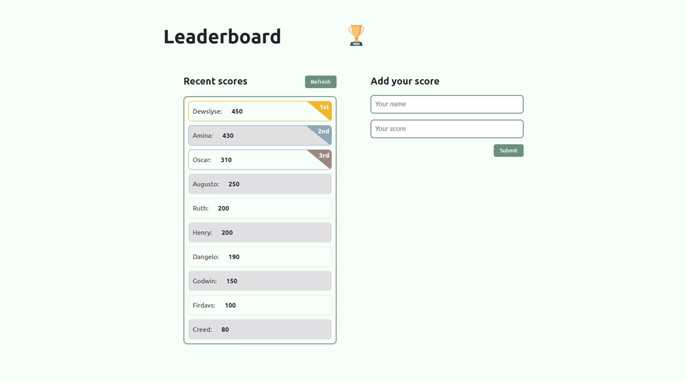

# Leaderboard

> This website displays scores submitted by different players. It also alow you to submit a score.

## Screenshot

## Built With

- HTML
- CSS/SCSS
- JavaScript(ES6)
- Webpack

<!-- ## Live site 🚀

🔗 [Live Site Link](https://dewslyse.github.io/mv-to-do-list/) -->

## Getting Started

To get a local copy up and running follow this simple step:

- Clone repository to your local machine: `git@github.com:dewslyse/mv-leaderboard-app.git`
- `cd mv-leaderboard-app`
- Run `npm install` to install dependencies
- Run `npm start` to start app

## Author

👤 **@dewslyse**

- GitHub: [@dewslyse](https://github.com/dewslyse)

## 🤝 Contributing

Contributions, issues, and feature requests are welcome!

Feel free to check the [issues page](../../issues/).

## Show your support

Give a ⭐️ if you like this project!

## Acknowledgments

- Hat tip to anyone whose code was used
- Inspiration
- etc

## 📝 License

This project is [MIT](./LICENSE) licensed.
